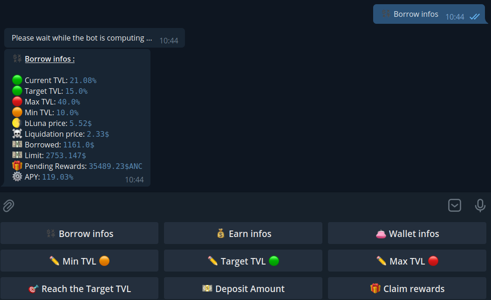
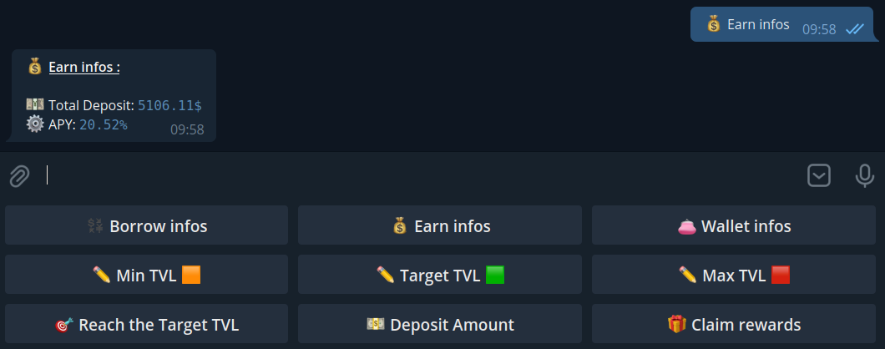
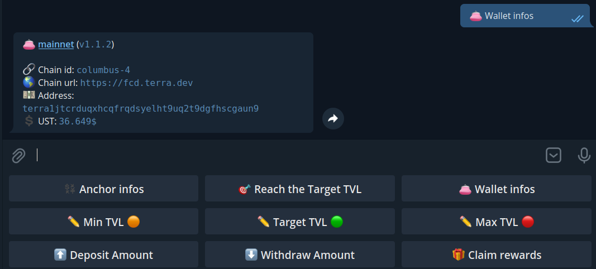
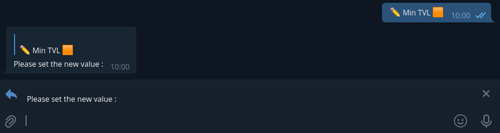
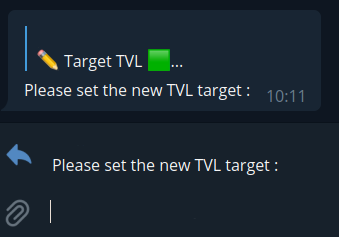
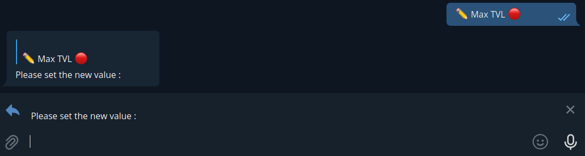
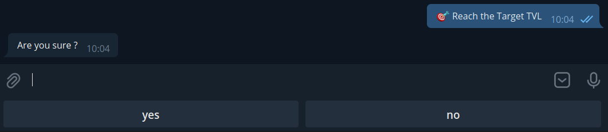
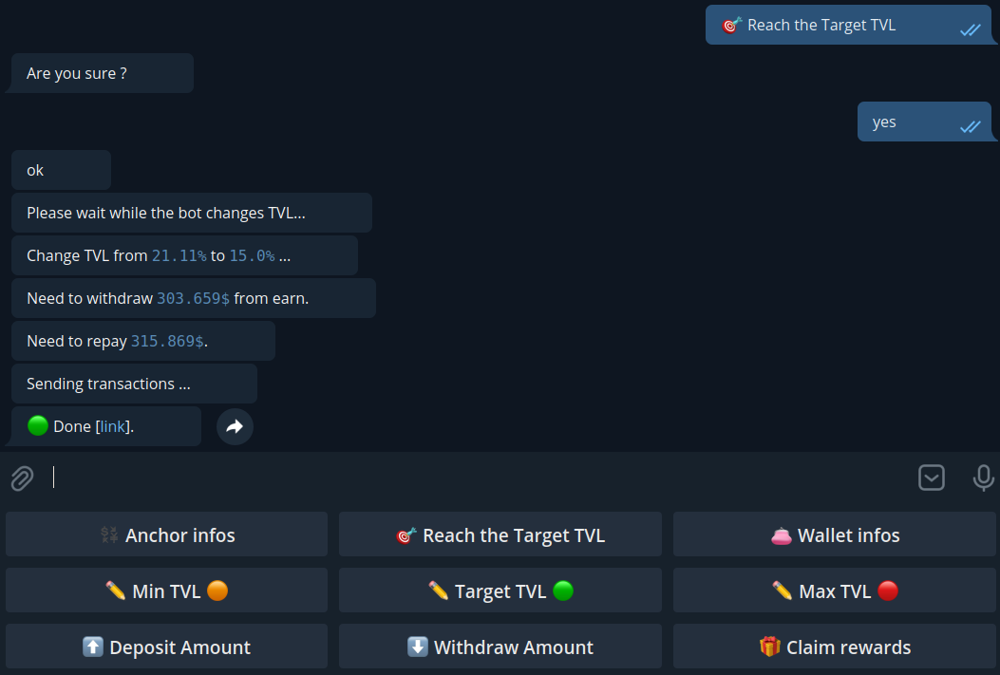
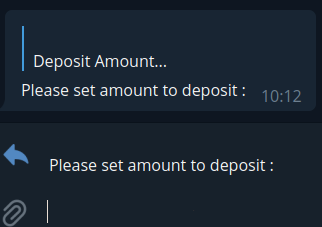
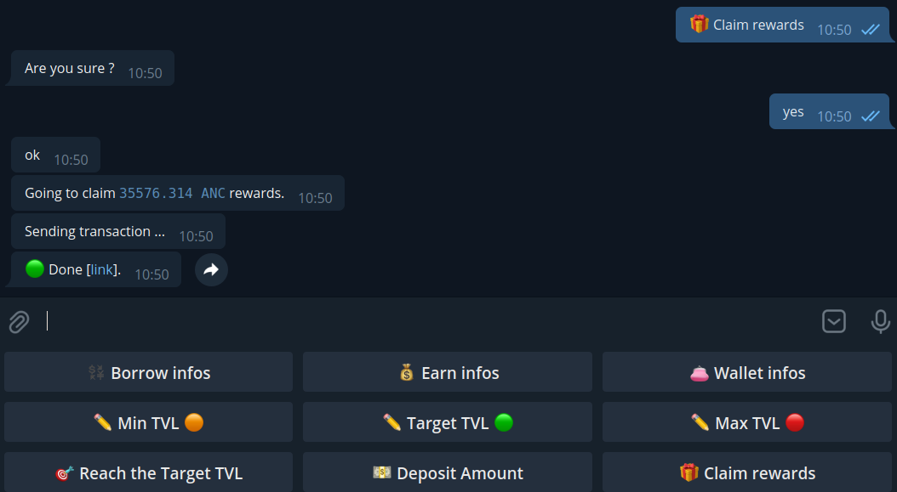

# Anchor borrow bot

The purpose of this bot is to manage the borrowing on Anchor, it pays back if the TVL is too high and it borrows if the TVL is too low. \
It is possible to view the status of the borrowing via telegram, claim rewards, adjust the TVL...

# How to configure
Copy the `env_sample` to `.env` file, and change the values to your needs.

#### **`.env example`**
``` bash
WALLET_MNEMONIC=<BASE64_ENCODED_MNEMONIC>
WALLET_NAME=Wallet#1
CHAIN_ID=columbus-4
CHAIN_URL=https://fcd.terra.dev
ANCHOR_mmMarket=terra1sepfj7s0aeg5967uxnfk4thzlerrsktkpelm5s
ANCHOR_mmOverseer=terra1tmnqgvg567ypvsvk6rwsga3srp7e3lg6u0elp8
ANCHOR_aTerra=terra1hzh9vpxhsk8253se0vv5jj6etdvxu3nv8z07zu
TARGET_TVL=35
MAX_TVL=40
MIN_TVL=30
TELEGRAM_TOKEN=<TELEGRAM_ID>
TELEGRAM_CHAT_ID=<OWNER_CHAT_ID>
```
**WALLET_MNEMONIC**
> this is the base64 encoded mnemonic phrase of your wallet, dont share it !!

**WALLET_NAME**
> (WIP, not yet used) this is the name of your wallet

**CHAIN_ID**
> terra chain id to use :
> - columbus-4 ***mainnet***
> - tequila-0004 ***tequila testnet***

**CHAIN_URL**
> terra chain url to use :
> - https://fcd.terra.dev ***mainnet***
> - https://tequila-lcd.terra.dev ***tequila testnet***

**ANCHOR_mmMarket**
> Anchor mmMarket contract address to use :
> - terra1sepfj7s0aeg5967uxnfk4thzlerrsktkpelm5s ***mainnet***
> - terra15dwd5mj8v59wpj0wvt233mf5efdff808c5tkal ***tequila testnet***

**ANCHOR_mmOverseer**
> Anchor mmOverseer contract address to use :
> - terra1tmnqgvg567ypvsvk6rwsga3srp7e3lg6u0elp8 ***mainnet***
> - terra15dwd5mj8v59wpj0wvt233mf5efdff808c5tkal ***tequila testnet***

**ANCHOR_aTerra**
> Anchor aTerra contract address to use :
> - terra1hzh9vpxhsk8253se0vv5jj6etdvxu3nv8z07zu ***mainnet***
> - terra1ajt556dpzvjwl0kl5tzku3fc3p3knkg9mkv8jl ***tequila testnet***

**TARGET_TVL**
> the target TVL for your borrow

**MAX_TVL**
> the MAX TVL allowed for your borrow. If the TVL go higher, the bot set automatically the TVL to the target by paying back

**MIN_TVL**
> the MIN TVL allowed for your borrow. If the TVL go lower, the bot set automatically the TVL to the target by borrowing more

**TELEGRAM_TOKEN**
> the telegram token of your bot

**TELEGRAM_CHAT_ID**
> As it's not a public bot, set your chat id so that it can only chat with you


# How to run

It's a python program, just install python 3 and start with : \
`python start.py`

Or use docker: \
`docker-compose build` \
then \
`docker-compose up -d`


# What can it do

## Show your Borrow datas
- current TVL
- Target TVL
- Max allowed TVL
- Min allowed TVL
- Borrowed amount
- Borrow Limit amount
- Pending $ANC rewards



## Show your Earn datas
- Total deposit
- Current Earn APY



## Show your wallet infos
- wallet address
- uusd amount in your wallet 



## Set the MIN TVL allowed

 The bot ask you to enter the value of the new **MIN** TVL allowed. \
 The value must be **lower** than the current **target** TVL and **lower** than the **MAX** TVL




## Set the Target TVL

 The bot ask you to enter the value of the new **target** TVL. \
 The value must be **higher** than the **MIN** TVL and **lower** than the **MAX** TVL




 ## Set the MAX TVL allowed

 The bot ask you to enter the value of the new **MAX** TVL allowed. \
 The value must be **higher** than the current **target** TVL and **higher** than the **MIN** TVL




## Force to set the TVL to the target
The bot will repay or borrow to reach the target TVL. \
If the bot is borrowing, it will deposit automatically the amount to Earn







## Deposit UST to earn
If you have some unused UST in your wallet, you can do a deposit to Earn. \
The bos ask you the amount you want to deposit. \
Keep in mind, you must have this amount in your wallet.




## Claiming rewards
The bot will claim rewards for you




