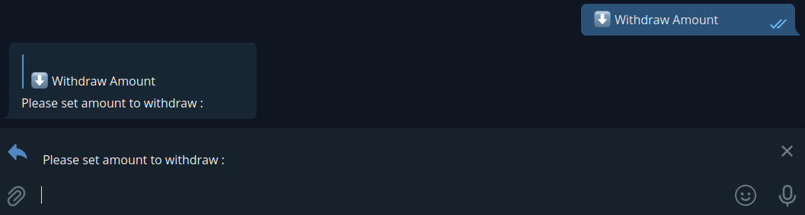

# Anchor borrow bot

The purpose of this bot is to manage the borrowing on Anchor, it pays back if the LTV is too high and it borrows if the LTV is too low. \
It is possible to view the status of the borrowing via telegram, claim rewards, adjust the LTV...

# How to configure
Copy the `env_sample` to `.env` file, and change the values to your needs.

#### **`.env example`**
``` bash
WALLET_MNEMONIC=<BASE64_ENCODED_MNEMONIC>
WALLET_NAME=Wallet#1
CHAIN_ID=columbus-5
CHAIN_URL=https://lcd.terra.dev
ANCHOR_mmCustody=terra1ptjp2vfjrwh0j0faj9r6katm640kgjxnwwq9kn
Mantle_endpoint=https://mantle.terra.dev
TARGET_TVL=35
MAX_TVL=40
MIN_TVL=30
TELEGRAM_TOKEN=<TELEGRAM_ID>
TELEGRAM_CHAT_ID=<OWNER_CHAT_ID>
UST_MIN_AMOUNT_ALERT=10
```
**WALLET_MNEMONIC**
> this is the base64 encoded mnemonic phrase of your wallet, dont share it !!

**WALLET_NAME**
> this is the name of your wallet

**CHAIN_ID**
> terra chain id to use :
> - columbus-5 ***mainnet***
> - bombay-12 ***bombay testnet***

**CHAIN_URL**
> terra chain url to use :
> - https://lcd.terra.dev ***mainnet***
> - https://bombay-lcd.terra.dev ***bombay testnet***

**ANCHOR_mmCustody**
> Anchor mmCustody contract address to use :
> - terra1ptjp2vfjrwh0j0faj9r6katm640kgjxnwwq9kn ***mainnet***
> - terra1ltnkx0mv7lf2rca9f8w740ashu93ujughy4s7p ***tequila testnet***

**Mantle_endpoint**
> Mantle endpoint to get borrow APY :
> - https://mantle.anchorprotocol.com ***mainnet***
> - https://bombay-mantle.terra.dev ***bombay testnet***


**TARGET_TVL**
> the target LTV for your borrow

**MAX_TVL**
> the MAX LTV allowed for your borrow. If the LTV go higher, the bot set automatically the LTV to the target by paying back

**MIN_TVL**
> the MIN LTV allowed for your borrow. If the LTV go lower, the bot set automatically the LTV to the target by borrowing more

**TELEGRAM_TOKEN**
> the telegram token of your bot

**TELEGRAM_CHAT_ID**
> As it's not a public bot, set your chat id so that it can only chat with you

**UST_MIN_AMOUNT_ALERT**
> threshold below which the bot sends an alert to warn about low usd in the wallet


# How to run

It's a python program, just install python 3 and start with : \
`python start.py`

Or use docker: \
`docker-compose build` \
then \
`docker-compose up -d`


# What can it do

## Show your Anchor datas
- current LTV
- Target LTV
- Max allowed LTV
- Min allowed LTV
- Current bLuna price
- Liquidation price
- Borrowed amount
- Borrow Limit amount
- Pending $ANC rewards
- Current Borrow APY

- Total deposit
- Current Earn APY


## Show your wallet infos
- wallet name : (Bot version)
- chain id
- chain url
- wallet address
- uusd amount in your wallet 


## Set the MIN LTV allowed

 The bot ask you to enter the value of the new **MIN** LTV allowed. \
 The value must be **lower** than the current **target** LTV and **lower** than the **MAX** LTV


## Set the Target LTV

 The bot ask you to enter the value of the new **target** LTV. \
 The value must be **higher** than the **MIN** LTV and **lower** than the **MAX** LTV


 ## Set the MAX LTV allowed

 The bot ask you to enter the value of the new **MAX** LTV allowed. \
 The value must be **higher** than the current **target** LTV and **higher** than the **MIN** LTV


## Force to set the LTV to the target
The bot will repay or borrow to reach the target LTV. \
If the bot is borrowing, it will deposit automatically the amount to Earn


## Deposit UST to earn
If you have some unused UST in your wallet, you can do a deposit to Earn. \
The bot ask you the amount you want to deposit. \
Keep in mind, you must have this amount in your wallet.


## Withdraw UST from earn
If you have need some UST, you can withdraw any amount from Earn. \
The bot ask you the amount you want to witdrawn. \




## Claiming rewards
The bot will claim rewards for you


## contact
If you have any questions or remarks, you can contact me on telegram.
Tell me right away that you are contacting me about the bot so that I don't block you by reflex (a lot of scam on tg)
telegram contact : @Rambogosse
